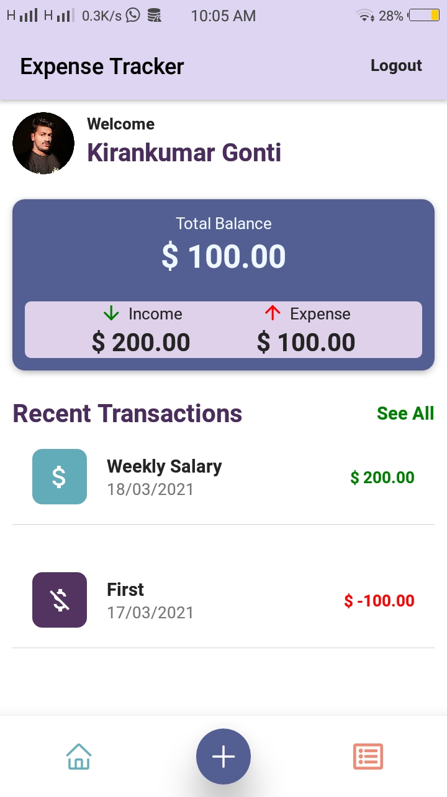

# Expense Tracker with React Native

## Snapshot



## Quick Start

    # Clone the application
    $ git clone https://github.com/kirankumargonti/expense-tracker-react-native.git

    # Install dependencies
    $ npm install
        or
    $ expo install

    # Run application
    $ npm start
        or
    $ expo start


## Project Setup

### 1. Firebase Setup

- [ Create a Project and add Firebase Configuration](https://firebase.google.com/docs/web/setup) to
firebase.js file it looks like this

  ```
  const firebaseConfig = {

      apiKey: "",
      authDomain: "",
      databaseURL: "",
      projectId: "",
      storageBucket: "",
      messagingSenderId: ": "",
      measurementId: ""

  };
  ```

### 2. Email / Password Authentication

- Goto Authentication tab left side of your project Dashboard
- Enable [Email / Password Authentication](https://firebase.google.com/docs/auth/web/password-auth) to your project


### 3. Database Setup
  - Goto Firestore tab left side of your project Dashboard

  - Create a  **Firestore** database

### 4. Deployment

    # Login to Expo
    $ expo login

    # Run build
    $ expo build:android

    # Initialize your firebase project
    $ firebase init

    # Make sure to choose your package name
    # Make sure to choose your package apk
    # Follow the reaming steps
    # Download your android apk fro your expo dashboard

#### For more information refer Expo docs 
https://docs.expo.io/workflow/configuration/